# Penjelasan Praktikum TCC Minggu-03
 

# Tugas
 

1. Untuk proses berikutnya akan melakukan login pada heroku, disini saya menggunakan command git-bash untuk melakukan penagaksesan heroku. berikut merupakan perintahnya : 
<dd>

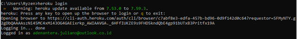

Dari perintah diatas apabila sudah mengisi perintah "heroku login", maka secara otomatis akan lansung terhubung ke web heroku yaitu halaman login. Seperti pada gambar dibawah ini : 

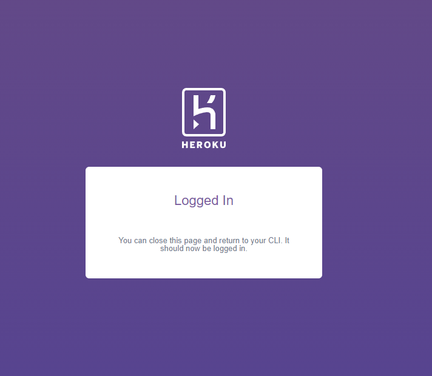

2. Selanjutnya mengecek versi dari php, composer dan git dari komputer local yang sebelumnya sudah diinstal, untuk perintah dan hasil eksekusinya seperti pada gambar dibawah ini : 
<dd>

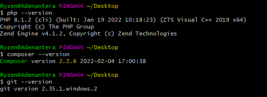

3. Pada bagian ke-3 ini dilakukan proses clonning dari git heroku untuk mengambil repo "php-getting-started" ke bash lokal komputer dan masuk ke repo lokal yang baru di clonning, dan kemudian selanjutnya membuat app bauru kita pada heroku. untuk perintahnya seperti pada gambar yang tertera dibawah ini : 
<dd>

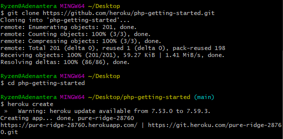

4. Kemudian selanjutnya melakukan push ke branch master heroku dengan menggunakan perintah "git push heroku master". Untuk perintah dan hasilnya seperti pada gambar dibawah ini : 
<dd>

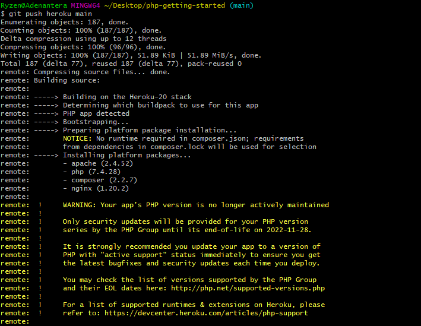
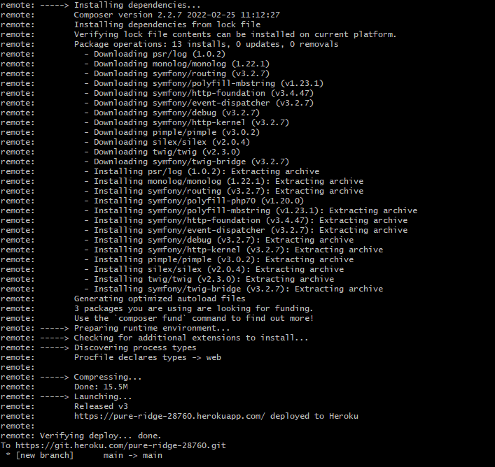

5. Kemudian selanjutnya melakukan konfiguasi pada web scale dengan nilai konfigurasinya 1, apabila 1 maka app yang di create pada heroku dapat diakses, dan kemudian untuk membukanya dengan menggunakan perintah "heroku open". seperti pada gambar dibawah ini : 
<dd>

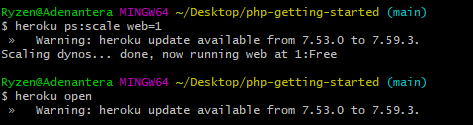

<dd>Sehingga hasil yang di tampilkan pada web browser seperti dibawah ini : 

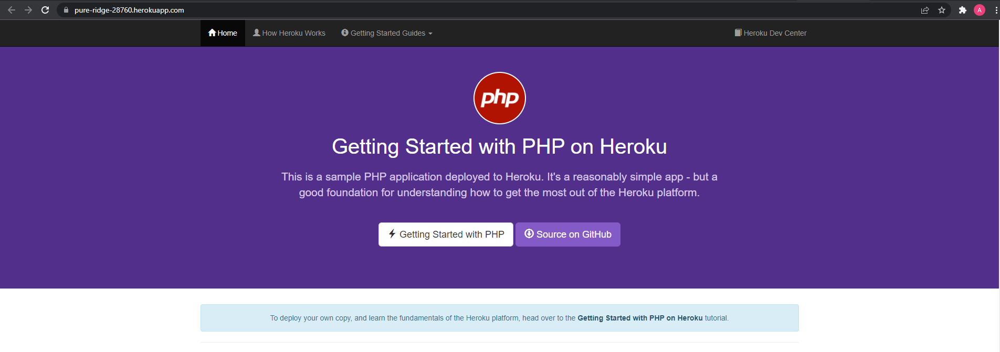

6. Kemudian selanjutnya melakukan update composer, dari bash commmand git, untuk perintah dan hasilnya seperti yang terlihat pada gambar dibawah ini : 
<dd>

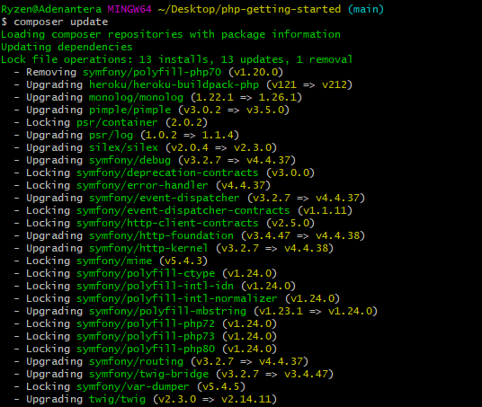
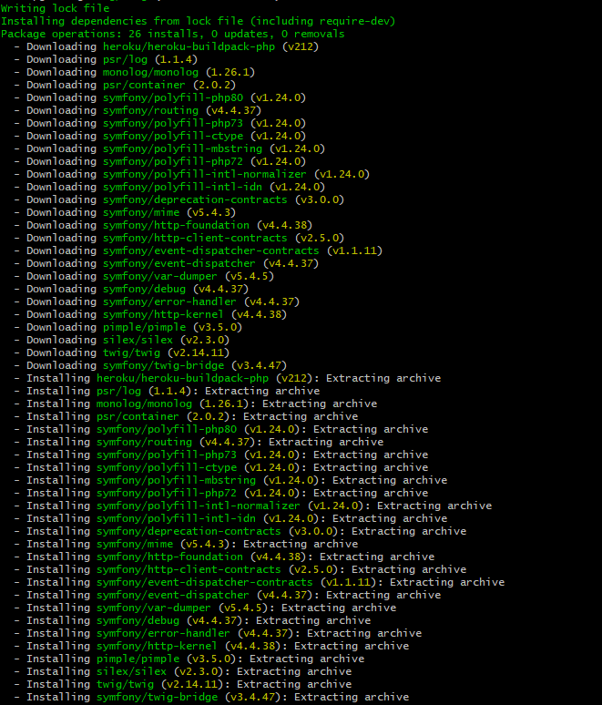
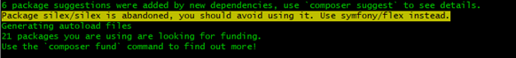

Sehingga hasil yang di tampilkan pada repo lokal yang di conning sebelumnya, dimana pada direktori vendor akan terdapat file autoload.php dari hasil update composer tersebut : 

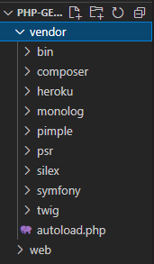

7. Selanjutnya dari hasil update composer tersebut masih memerlukan direktori arlik11es dan didalamnya akan di install atau ditambahkan direktori cowsayphp, dan kemudian baru dilakukan update composernya lagi. Untuk perintah dan hasilnya seperti pada gambar dibawah ini : 
<dd>

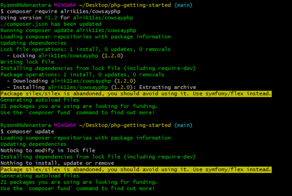

Sehingga hasil yang di tampilkan pada repo lokal yang di conning sebelumnya, dimana pada direktori vendor akan terdapat direktori arlik11es/cowsayphp dari hasil update composer tersebut : 

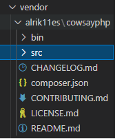

8. Kemudian selanjutnya melakukan perubahan pada file index.php yang terdapat pada direktori web pada repo lokal hasil clonning sebelumnya. untuk prosesnya seperti pada gambar dibawah ini :  
<dd>

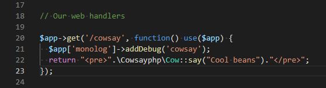

9. Dan selanjutnya dilakukan push pada app heroku kita, dengan langkah perintah seperti yang tertera pada gambar dibawah ini : 
<dd>

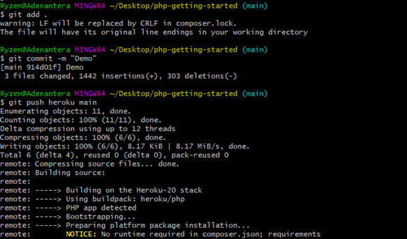

Dan kemudian untuk melihat hasil dari push tersebut, dengan menggunakan perintah "git open cowsay", seperti pada gambar dibawah ini : 

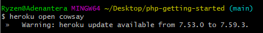

Sehingga hasil yang ditapilkan pada halaman url app heroku kita, seperti pada gambar dibawah ini : 

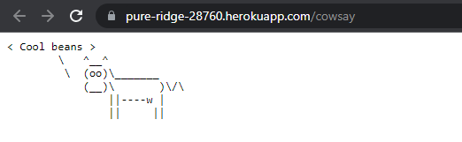

10. Selanjutnya akan dilakukan pengecekan dengan menjalankan pada bash lokal heroku, apabila berhasil maka proses running app kita akan dilihat disitu, seperti pada gambar dibawah ini : 
<dd>

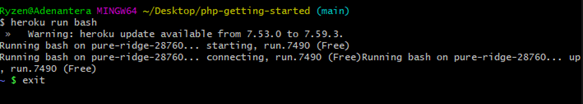