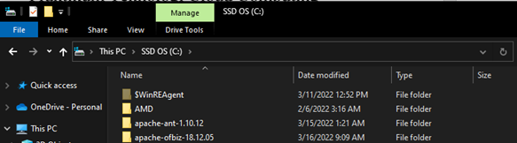
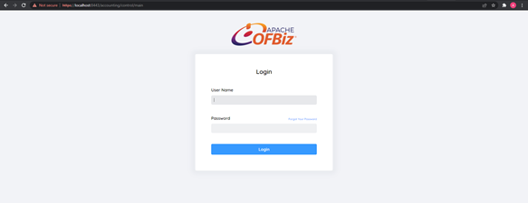

# Penjelasan Praktikum TCC Minggu-05    Latihan

1. Pada bagian yang pertama ini, melakukan proses exract file apache ofbiz yang sebelumnya sudah di download, Seperti gambar dibawah ini :
<dd>

</dd>

2. selanjutnya pada proses penginstalannya, masuk ke dir dimana apache ofbiz diextract atau disimpan melalui cmd, lalu saya ketikan perintah “init-gradle-wrapper” untuk mendownload gradle wrapper 
<dd>

Selanjutnya saya ketikan lagi perintah “gradlew cleanAll loadAll” dan tunggu hingga proses load selesai.

</dd>

3. Kemudian untuk memulai ofbiz bisa ketikan perintah “gradlew ofbiz” 
<dd>

Untuk mencoba pengujiannya bisa membuka server local ofbiz yaitu <b>https://localhost:8443/accounting</b> 

Sehingga ketika akses ke localhost ofbiz dilakukan maka secara otomatis kita akan diahlikan ke halaman login, seperti pada gambar dibawah ini : 

Untuk melakukan login dengan menggunakan username : <b>admin</b> dan password : <b>ofbiz</b> .
</dd>