# Latihan Minggu Ke-06

<h3>A. Implementasi Program Go Untuk Membaca Data Pada Mysql</h3>

1. Pastikan telah mendownload compiler Go melalui link yg telah disediakan. Install Go seperti terlihat pada gambar dibawah tinggal klik next – next saja.  
<dd>

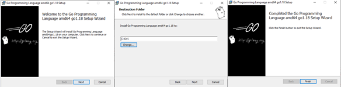

</dd>

2. Untuk mengecek Go berhasil terinstall dan siap untuk digunakan.
<dd>

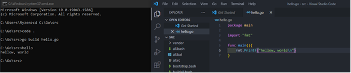

</dd>

3. Pastikan telah mendownload MongoDB melalui link yg telah disediakan. Install MongoDB seperti terlihat pada gambar dibawah tinggal klik next - next saja 
<dd>

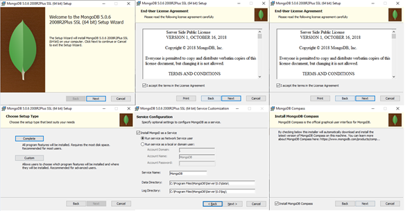

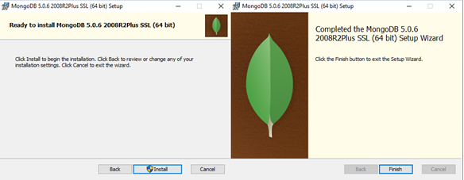

</dd>

4. Melakukan instalasi driver mysql untuk bisa terkoneksi ke mysql server, seperti pada gambar dibawah ini:  
<dd>

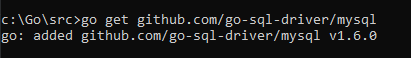

</dd>

5. Kemudian sebelumnya mengecek ulang database dan tabel, serta isian data yang sebelumnya sudah di insert pada tabel. Seperti pada gambar dibawah ini:  
<dd>

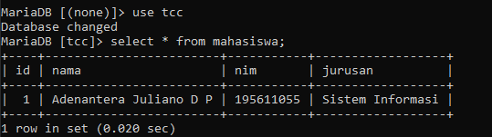

</dd>

6. Selanjutnya membuat program go untuk melakukan koneksi ke database dengan melakukan remote ke mysql server dan kemudian mengekusinya dan melakukan baca data dari database dan tabel, Seperti pada script program dibawah ini:

| Koneksi                                          | Membaca Data Mysql                                     |
| ------------------------------------------------ | ------------------------------------------------------ |
| [Lihat Script](/minggu-06/image/latihan/main.go) | [Lihat Script](/minggu-06/image/latihan/baca-mysql.go) |

Sehingga hasil yang ditampilkan ketika melakukan eksekusi terhadapat program koneksi dan baca data mysql, akan menghasilkan output seperti pada ambar dibawah ini : 

1. Output untuk program koneksi : 
   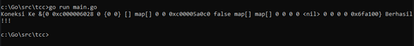
2. Output untuk Program Membaca Data MySql : 
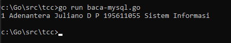
</dd>

<h3>B. Implementasi Program Go Untuk Membaca Data Pada MongoDB</h3>

1. Kemudian selanjutnya melakukan download dirver mongodb seperti pada gambar dibawah ini:  

<dd>

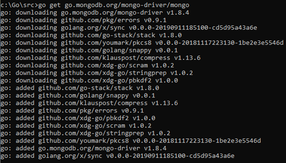

</dd>

2. Kemudian saya membuat database baru pada mongodb compass dengan nama tcc dan didalamnya dibuat collection dengan nama mahasiswa seperti gambar dibawah: 
<dd>

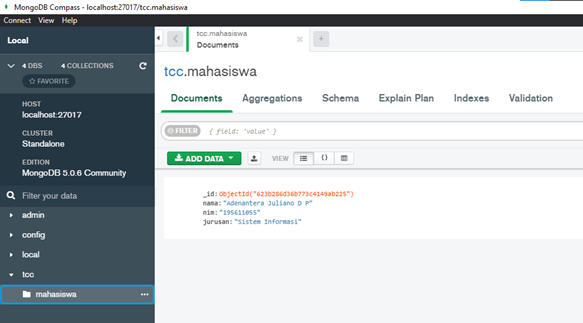

</dd>

3. Selanjutnya membuat program go untuk melakukan koneksi ke database dengan melakukan remote ke mongodb server dan kemudian mengekusinya dan melakukan baca data dari database dan collection, Seperti pada script program dibawah ini:  

| Koneksi                                                     | Membaca Data MongoDB                                     |
| ----------------------------------------------------------- | -------------------------------------------------------- |
| [Lihat Script](/minggu-06/image/latihan/connect-mongodb.go) | [Lihat Script](/minggu-06/image/latihan/baca-mongodb.go) |

Sehingga hasil yang ditampilkan ketika melakukan eksekusi terhadapat program koneksi dan baca data mongodb, akan menghasilkan output seperti pada ambar dibawah ini : 

1. Output untuk program koneksi : 
   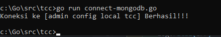
2. Output untuk Program Membaca Data MySql : 
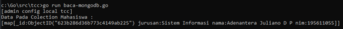
</dd>
</dd>
