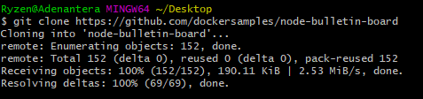
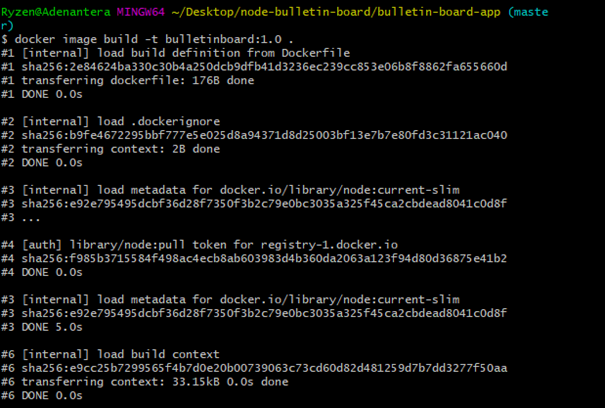

# Latihan Minggu Ke-07

<h3>Installasi Docker</h3>

1. Proses melakukan instalasi docker dekstop, untuk melakukan instalasi docker dekstop ada beberapa ketentuan yakni:

<dd>

</dd>

Pada proses ini tunggu sampai proses pengistalan selesai. Apabila sudah selesai maka langkah selanjutnya klik saja finish.

<dd>

</dd>

2. Lankah selanjutnya masuk pada command promt lalu jalankan perintah seperti pada dibawah ini:

<dd>

</dd>

cek versi docker
jalankan perintah docker --version

menjalankan docker image hello-world
jalankan perintah docker run hello-world

menampilkan seluruh struktur daftar image hello-world
jalankan perintah docker container ls --all

3. Build and run image

mengcloning repo berdasarkan url
jalankan perintah $ git clone https://github.com/dockersamples/node-bulletin-board

<dd>

</dd>

berpindah direktori
jalankan perintah $ cd node-bulletin-board/bulletin-board-app

<dd>

</dd>

build image docker
jalankan perintah $ docker image build -t bulletinboard:1.0 .

<dd>

</dd>

menjalankan container untuk melihat docker image nantinya secara local yakni pada localhost:8000
jalankan perintah $ docker container run --publish 8000:8080 --detach --name bb bulletinboard:1.0

<dd>

</dd>

menghapus container image
jalankan perintah $ docker container rm --force bb

4. Share image on Docker Hub

Sebelumnya kita harus membuat akun docker hub terlebih dahulu, jika sudah kita membuat repo baru dengan nama bulletinboard.

<dd>

</dd>

share image kita ke docker hub
jalankan perintah $ docker image tag bulletinboard:1.0 adenantera/bulletinboard:1.0

<dd>

</dd>

push image kita ke docker hub
jalankan perintah $ docker image push adenantera/bulletinboard:1.0

<dd>

</dd>

Untuk adenantera dapat disesuaikan dengan username dockerhub kita masing-masing.
Untuk bulletinboard:1.0 dapat disesuaikan juga pada image yg kita buat.

Untuk melihat hasilnya kita dapat membuka tab baru dan isikan url dengan localhost:8000

<dd>

</dd>
