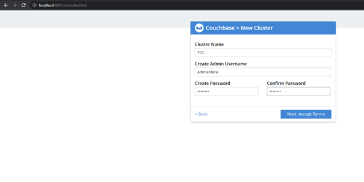

# Tugas Minggu Ke - 07

1. Couchbase image from DockerHub

pull library couchbase
jalankan perintah $ docker pull couchbase

<dd>

</dd>

run couchbase Server docker container
jalankan $ docker run -d --name db -p 8091-8094:8091-8094 -p 11210:11210 couchbase

<dd>

</dd>

Untuk melihat hasilnya kita dapat membuka tab baru dan isikan url dengan http://localhost:8091

<dd>

</dd>
