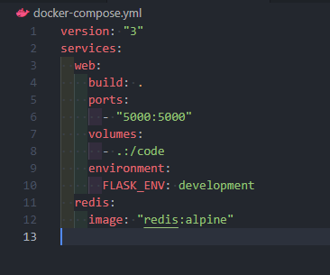

# Praktikum Teknologi Cloud Computing - Minggu 8 (LATIHAN)

---

1. Membuat folder proyek

<dd>

</dd>

Untuk membuat folder baru dengan nama composetest.
jalankan $ mkdir composetest seperti gambar diatas.

Untuk berpindah ke folder composetest.
Jalankan Perintah $ cd composetest/ seperti gambar diatas.

Untuk membuka code editor vscode.
Jalankan perintah $ code . seperti gambar diatas.

2. Membuat file app.py

<dd>

</dd>

[File app.py](app.py)

3. Membuat file requirements.txt

<dd>

</dd>

[File requirements.txt](requirements.txt)

4. Create a Dockerfile

<dd>

</dd>

[File Dockerfile](Dockerfile)

5. Define services in a Compose file

<dd>

</dd>

[File docker-compose.yml](docker-compose.yml)

6. Menjalankan perintah docker-compose up.

<dd>

</dd>

Mulai menjalankan aplikasi.
Jalankan perintah $ docker-compose up.

7. Membuka url http://localhost:5000/ untuk melihat hasilnya

<dd>

</dd>

8. Merefresh halaman

<dd>

</dd>

9. Membuka terminal lain dan menjalankan perintah $ docker image ls.

<dd>

</dd>

10. Edit the Compose file to add a bind mount

<dd>

</dd>

[File docker-compose.yml](docker-compose.yml)

11. Re-build and run the app with Compose dengan menjalankan perintah docker-compose up.

<dd>

</dd>

12. Mengecek pada browser

<dd>

</dd>

13. Update the application dan merubah file app.py

<dd>

</dd>

14. Mengecek hasilnya pada browser

<dd>

</dd>

15. Experiment with some other commands dan Menjalankan perintah docker lainnya

<dd>

</dd>

Menjalankan aplikasi pada latar belakang.
Jalankan perintah $ docker-compose up -d seperti gambar diatas.

Melihat aplikasi yang sedang berjalan.
Jalankan perintah $ docker-compose ps seperti gambar diatas.

16. Menjalankan perintah docker lainnya

<dd>

</dd>

Menjalankan dan melihat variabel yang tersedia.
Jalankan perintah $ docker-compose run web env seperti gambar diatas.

Menghentikan aplikasi.
Jalankan perintah $ docker-compose stop seperti gambar diatas.

Menghapus containers.
Jalankan perintah $ docker-compose down --volumes seperti gambar diatas.
