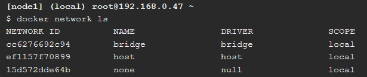
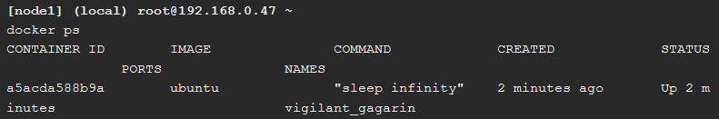
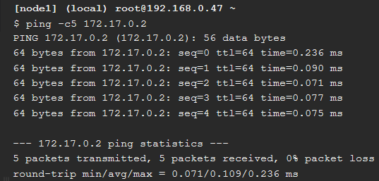
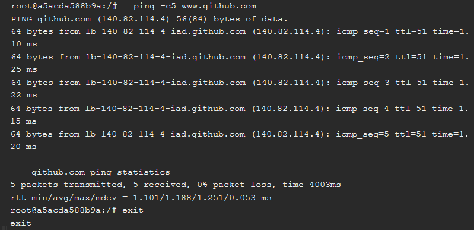
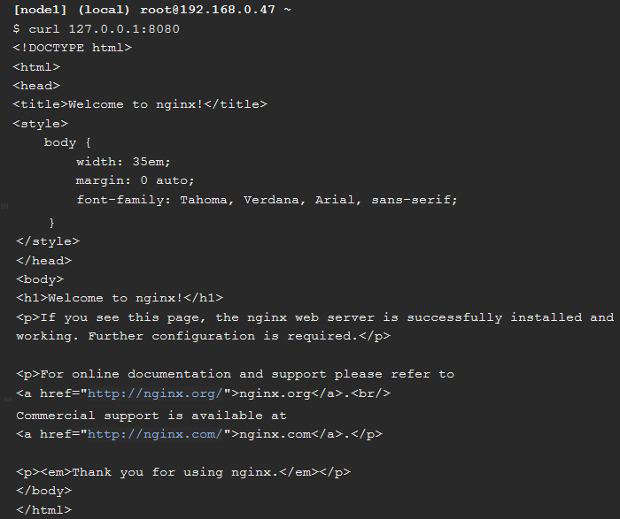
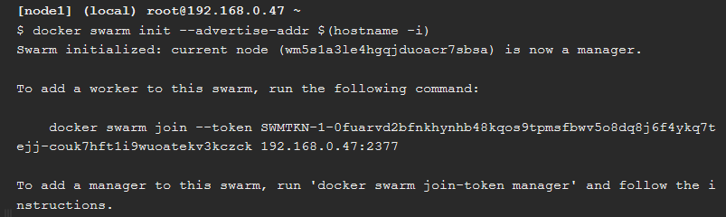
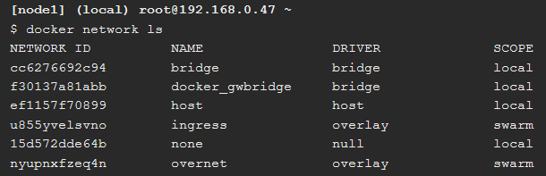
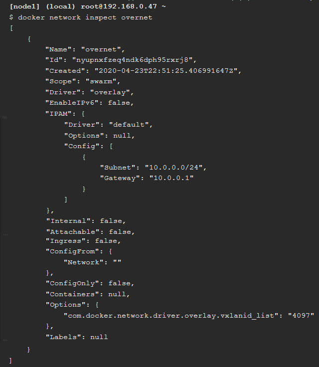
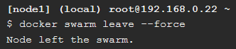

# Praktikum Teknologi Cloud Computing - Minggu 10 (Docker Networking)

## Login akun Docker

---


Untuk dapat mengakses terminal linux pada web ini yakni dengan login terlebih dahulu menggunakan akun Docker kita.

---

## Section #1 - Networking Basics

---

**Step 1: The Docker Network Command**


```
//Merupakan perintah utama untuk konfigurasi dan mengelola container networks
$ docker network
```

**Step 2: List networks**



```
//Menampilkan daftar container networks
$ docker network ls
```

**Step 3: Inspect a network**


```
//Melihat detail konfigurasi jaringan
$ docker network inspect bridge
```

**Step 4: List network driver plugins**


```
//Melihat informasi mengenai installasi Docker
$ docker info
```

---

## Section #2 - Bridge Networking

---

**Step 1: The Basics**


```
//Menampilkan daftar container networks
$ docker network ls

//Mengupdate dan install packages bridge-utils
$ apk update

//Menambahkan packages bridge-utils
$ apk add bridge

//Menampilkan daftar bridges pada Docker host
$ brctl show

//Melihat detail bridge
$ ip a
```

**Step 2: Connect a container**





```
//Membuat container baru
$ docker run -dt ubuntu sleep infinity

//Melihat spek container network
$ docker ps

//Menampilkan daftar bridges pada Docker host
$ brctl show

//Menampilkan lampiran pada container bridge
$ docker network inspect bridge
```

**Step 3: Test network connectivity**







```
//Mengetes jaringan (ping)
$ ping -c5 172.17.0.2

//Melihat spek container network
$ docker ps

//Masuk terminal ubuntu
$ docker exec -it yourcontainerid /bin/bash

//Menginstall program ping
$ apt-get update && apt-get install -y iputils-ping

//Mengetes jaringan (ping)
$ ping -c5 www.github.com

//Keluar dari terminal ubuntu
$ exit

//Menghentikan container yang sedang berjalan
$ docker stop yourcontainerid
```

**Step 4: Configure NAT for external connectivity**




```
//Menjalankan container baru dari official NGINX image
$ docker run --name web1 -d -p 8080:80 nginx

//Melihat spek container network
$ docker ps

//Menghubungkan ke docker host
$ curl 127.0.0.1:8080
```

---

## Section #3 - Overlay Networking

---

**Step 1: The Basics**




```
//Menginisialisasi docker swarm baru
$ docker swarm init --advertise-addr $(hostname -i)

//Menggabungkan node
$ docker swarm join \
>     --token SWMTKN-1-69b2x1u2wtjdmot0oqxjw1r2d27f0lbmhfxhvj83chln1l6es5-37ykdpul0vylenefe2439cqpf \
>     10.0.0.5:2377

//Melihat daftar node
$ docker node ls
```

**Step 2: Create an overlay network**






```
//Membuat sebuah overlay network
$ docker network create -d overlay overnet

//Mengecek/menampilkan network
$ docker network ls

//Melihat lebih detail informasi mengenai overnet network
$ docker network inspect overnet
```

**Step 3: Create a service**


```
//Membuat layanan baru
$ docker service create --name myservice \
--network overnet \
--replicas 2 \

//Mengecek/menampilkan daftar layanan
$ docker service ls

//Melihat daftar layanan yang sedang berjalan
$ docker service ps myservice

//Mengecek/menampilkan network
$ docker network ls

//Melihat lebih detail informasi mengenai overnet network
$ docker network inspect overnet
```

**Step 4: Test the network**


```
//Melihat lebih detail informasi mengenai overnet network
$ docker network inspect overnet

//Melihat spek container network
$ docker ps
```

---

## Cleaning Up




```
//Menghspus layanan
$ docker service rm myservice

//Melihat spek container network
$ docker ps

//Menghapus node
$ docker swarm leave --force
```

---
